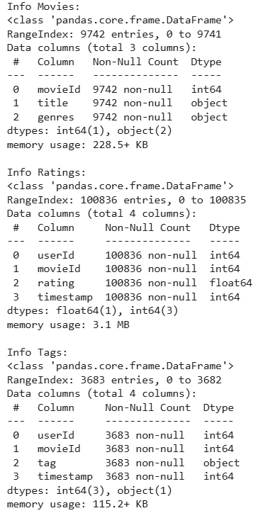
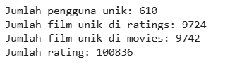
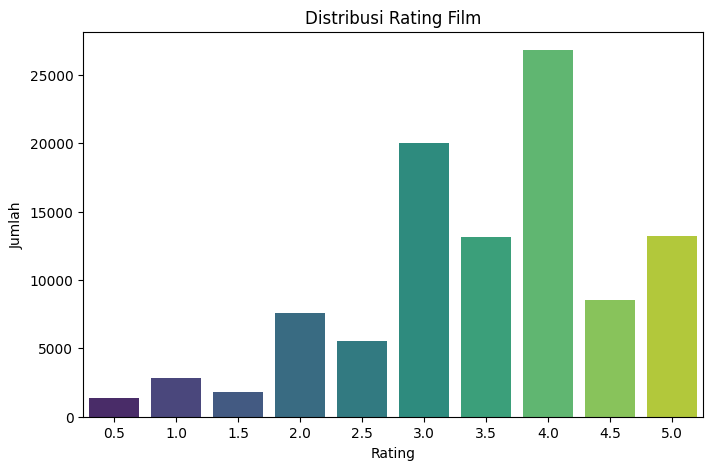
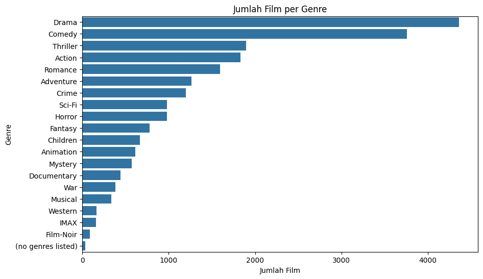

# Laporan Proyek Machine Learning - Sistem Rekomendasi Film

**Nama:** Muhamad Hamzah
**Dataset:** MovieLens (versi ~100k ratings, ~9.7k movies)

---

## Project Overview (Ulasan Proyek)

### Latar Belakang

Dalam era digital saat ini, jumlah konten hiburan, khususnya film, yang tersedia bagi konsumen telah meledak. Platform *streaming* seperti Netflix, Disney+, dan lainnya menawarkan ribuan hingga jutaan judul film. Meskipun ini memberikan banyak pilihan, pengguna seringkali dihadapkan pada *information overload* atau kebingungan dalam memilih film yang sesuai dengan preferensi mereka. Fenomena ini dapat mengurangi kepuasan pengguna dan efektivitas platform dalam menyajikan konten, fenomena yang dikenal sebagai "paradox of choice" [1].

Sistem rekomendasi film dirancang untuk mengatasi masalah ini. Dengan menganalisis riwayat tontonan, preferensi yang dinyatakan, dan karakteristik film, sistem ini dapat menyarankan judul-judul yang paling mungkin relevan dan menarik bagi pengguna individu. Industri film global terus mengalami pertumbuhan signifikan, dengan nilai pasar mencapai miliaran dollar setiap tahunnya [2]. Platform streaming seperti Amazon telah membuktikan efektivitas sistem rekomendasi dalam meningkatkan kepuasan pengguna dan penjualan selama lebih dari dua dekade [3]. Netflix bahkan mengembangkan personalisasi hingga ke level artwork untuk meningkatkan engagement pengguna [4].

### Domain Proyek

Sistem rekomendasi merupakan salah satu aplikasi *machine learning* yang paling sukses dan banyak digunakan dalam industri teknologi saat ini. Dengan memanfaatkan data historis pengguna dan karakteristik item, sistem ini mampu memberikan prediksi yang akurat tentang preferensi pengguna terhadap item yang belum pernah mereka konsumsi sebelumnya.

**Referensi:**
1. Schwartz, B. (2004). *The Paradox of Choice: Why More Is Less*. Harper Perennial.
2. Motion Picture Association. (2020). *Theme Report 2019*. MPA.
3. Smith, B., & Linden, G. (2017). Two Decades of Recommender Systems at Amazon.com. *IEEE Internet Computing*, 21(3), 12-18.
4. Netflix Technology Blog. (2018). Artwork Personalization at Netflix. *Medium*. https://netflixtechblog.com/artwork-personalization-c589f074ad76

### Mengapa Proyek Ini Penting

Proyek pengembangan sistem rekomendasi film ini penting karena beberapa alasan:

1. **Meningkatkan Pengalaman Pengguna:** Membantu pengguna menemukan film yang mereka sukai dengan lebih mudah dan cepat, mengurangi frustrasi akibat terlalu banyak pilihan.
2. **Meningkatkan *Engagement* dan Retensi Pengguna:** Rekomendasi yang relevan dapat membuat pengguna lebih lama berinteraksi dengan platform dan meningkatkan loyalitas mereka.
3. **Nilai Bisnis bagi Platform:** Sistem rekomendasi yang efektif dapat secara langsung berkontribusi pada peningkatan konsumsi konten, jumlah langganan, dan pendapatan platform.
4. **Personalisasi Skala Besar:** Menyediakan pengalaman yang disesuaikan untuk setiap pengguna di antara jutaan pengguna dan film.

---


## Business Understanding

### Problem Statements (Pernyataan Masalah)

Berdasarkan analisis, beberapa pernyataan masalah utama yang ingin diatasi adalah:

1. **Information Overload:** Pengguna kesulitan memilih film dari ribuan pilihan yang tersedia, menyebabkan *decision fatigue* dan mengurangi kepuasan.
2. **Penemuan Konten Baru:** Pengguna mungkin tidak menyadari keberadaan film-film yang sesuai dengan selera mereka, terutama jika film tersebut kurang populer atau baru dirilis.
3. ***Cold Start Problem*:** Bagaimana memberikan rekomendasi yang akurat kepada pengguna baru yang belum memiliki riwayat aktivitas atau untuk film baru yang belum mendapatkan banyak interaksi?
4. **Kebutuhan akan Personalisasi:** Rekomendasi generik kurang efektif; pengguna mengharapkan saran yang disesuaikan dengan preferensi unik mereka.

### Goals (Tujuan)

Tujuan dari proyek sistem rekomendasi film ini adalah:

1. **Mengembangkan Sistem Rekomendasi yang Akurat:** Membangun model yang dapat memprediksi preferensi pengguna terhadap film dengan tingkat akurasi yang baik.
2. **Memberikan Rekomendasi yang Relevan dan Bervariasi:** Menghasilkan daftar rekomendasi Top-N yang sesuai dengan selera pengguna, sekaligus memperkenalkan film-film baru yang mungkin diminati.
3. **Mengatasi *Cold Start Problem* (Sebagian):** Mengimplementasikan pendekatan yang dapat memberikan rekomendasi bahkan dengan data historis yang minim untuk film.
4. **Menyajikan Dua Pendekatan Rekomendasi:** Mengimplementasikan dan membandingkan metode *Content-Based Filtering* dan *Collaborative Filtering*.

### Solution Approach

Untuk mencapai tujuan yang telah ditetapkan, proyek ini akan mengimplementasikan dua pendekatan utama dalam sistem rekomendasi:

1. **Content-Based Filtering:**
   - **Prinsip:** Merekomendasikan film berdasarkan kesamaan karakteristik atau fitur (konten) film dengan film yang pernah disukai pengguna sebelumnya atau film yang sedang dilihat.
   - **Implementasi Teknis:** Menggunakan TF-IDF dan Cosine Similarity pada fitur gabungan genre dan tag film.

2. **Collaborative Filtering:**
   - **Prinsip:** Merekomendasikan film berdasarkan preferensi pengguna lain yang memiliki pola rating atau selera serupa.
   - **Implementasi Teknis:** Menggunakan algoritma SVD (Singular Value Decomposition) untuk matrix factorization.

---

## Data Understanding

### Informasi Dataset

Dataset yang digunakan dalam proyek ini adalah **MovieLens 'latest small' dataset** (atau yang setara), yang dikumpulkan dan disediakan oleh GroupLens Research dari University of Minnesota.
* **Sumber Data:** [https://www.kaggle.com/datasets/abhikjha/movielens-100k](https://www.kaggle.com/datasets/abhikjha/movielens-100k)
* **Karakteristik Dataset (berdasarkan output EDA dari notebook):**
    * Jumlah film: 9.742
    * Jumlah rating: 100.836
    * Jumlah tag: 3.683
    * Jumlah pengguna unik: 610
* **Kondisi Data:** Dataset utama (`movies.csv`, `ratings.csv`, `tags.csv`) tidak memiliki nilai null pada kolom-kolom penting.

### Uraian Variabel/Fitur

1.  **`movies.csv`**:
    * `movieId`: ID unik untuk setiap film (Integer).
    * `title`: Judul film beserta tahun rilisnya (String).
    * `genres`: Genre film, dipisahkan oleh `|` (String).

2.  **`ratings.csv`**:
    * `userId`: ID unik untuk setiap pengguna (Integer).
    * `movieId`: ID unik untuk film yang diberi rating (Integer).
    * `rating`: Rating yang diberikan (Float, skala 0.5 hingga 5.0).
    * `timestamp`: Waktu saat rating diberikan (Integer, Unix timestamp).

3.  **`tags.csv`**:
    * `userId`: ID unik pengguna yang memberikan tag (Integer).
    * `movieId`: ID unik film yang diberi tag (Integer).
    * `tag`: Tag atau kata kunci yang diberikan pengguna untuk film (String).
    * `timestamp`: Waktu saat tag diberikan (Integer, Unix timestamp).

### Exploratory Data Analysis (EDA)

* **Pemuatan & Tampilan Awal:** Data dimuat dan `head()` ditampilkan untuk melihat struktur awal.
    ```python
    # Contoh snippet dari notebook
    ratings = pd.read_csv('ratings.csv')
    movies = pd.read_csv('movies.csv')
    tags = pd.read_csv('tags.csv')
    print(movies.head())
    ```
    *Output `movies.head()`:*
    ```
       movieId                               title                                        genres
    0        1                    Toy Story (1995)  Adventure|Animation|Children|Comedy|Fantasy
    1        2                      Jumanji (1995)                   Adventure|Children|Fantasy
    2        3             Grumpier Old Men (1995)                               Comedy|Romance
    3        4            Waiting to Exhale (1995)                         Comedy|Drama|Romance
    4        5  Father of the Bride Part II (1995)                                       Comedy
    ```

* **Informasi Struktur Data:** `movies.info()`, `ratings.info()`, `tags.info()` digunakan untuk memeriksa tipe data dan nilai non-null.

    *Insight:* Mengonfirmasi tidak ada nilai null pada kolom-kolom krusial.

* **Statistik Dasar:**
    ```python
    n_users = ratings['userId'].nunique() # 610
    n_movies_rated = ratings['movieId'].nunique() # 9724
    n_movies_total = movies['movieId'].nunique() # 9742
    n_ratings = len(ratings) # 100836
    ```

    *Insight:* Mengetahui jumlah entitas unik dan interaksi.

* **Distribusi Rating:** Plot `sns.countplot(x='rating', data=df_eda)` menunjukkan rating 4.0 paling sering diberikan.

    *Insight:* Pengguna cenderung memberi rating pada film yang mereka nikmati.

* **Distribusi Genre:** Plot `sns.barplot` untuk `genre_counts` menunjukkan Drama dan Comedy sebagai genre paling dominan.

    *Insight:* Memberikan gambaran komposisi genre dalam dataset.

---

## Data Preparation

Tahap data preparation melibatkan transformasi data mentah menjadi format yang sesuai untuk model machine learning. Berikut adalah tahapan lengkap yang dilakukan:

### 1. Pemrosesan Tags
- **Standardisasi:** Tags diubah menjadi huruf kecil untuk konsistensi format
- **Agregasi:** Tags untuk film yang sama digabungkan menjadi satu string per movieId
- **Alasan:** Menghindari duplikasi dan memungkinkan representasi lengkap tags per film

```python
tags['tag'] = tags['tag'].str.lower()
tags_agg = tags.dropna(subset=['tag']).groupby('movieId')['tag'].apply(lambda x: ' '.join(x)).reset_index()
```

### 2. Penggabungan Movies dan Tags
- **Merge:** DataFrame `movies` digabung dengan `tags_agg` menggunakan left join
- **Penanganan Missing:** Nilai NaN pada kolom `tag` diisi dengan string kosong
- **Alasan:** Membuat dataset komprehensif yang berisi informasi lengkap film

```python
movies_enhanced = pd.merge(movies, tags_agg, on='movieId', how='left')
movies_enhanced['tag'] = movies_enhanced['tag'].fillna('')
```

### 3. Pembuatan Fitur Gabungan ('Soup')
- **Normalisasi Genre:** Karakter `|` pada `genres` diganti dengan spasi
- **Feature Engineering:** Kolom `soup` dibuat dari gabungan `genres_processed` dan `tag`
- **Alasan:** Membuat representasi tekstual komprehensif untuk content-based filtering

```python
movies_enhanced['genres_processed'] = movies_enhanced['genres'].str.replace('|', ' ', regex=False)
movies_enhanced['soup'] = movies_enhanced['genres_processed'] + ' ' + movies_enhanced['tag']
movies_enhanced['soup'] = movies_enhanced['soup'].fillna('').str.strip()
```

### 4. TF-IDF Vectorization
- **Ekstraksi Fitur:** Menggunakan `TfidfVectorizer` untuk mengubah teks 'soup' menjadi vektor numerik
- **Stop Words:** Menghilangkan kata-kata umum bahasa Inggris yang tidak informatif
- **Alasan:** TF-IDF mengukur pentingnya kata dalam dokumen relatif terhadap koleksi dokumen, penting untuk content-based filtering

```python
tfidf_enhanced = TfidfVectorizer(stop_words='english')
tfidf_matrix_enhanced = tfidf_enhanced.fit_transform(movies_cb_enhanced['soup'])
```

### 5. Split Data untuk Collaborative Filtering
- **Train-Test Split:** Data dibagi menjadi 80% training dan 20% testing
- **Random State:** Diset untuk reproduktibilitas hasil
- **Alasan:** Memungkinkan evaluasi objektif performa model collaborative filtering

```python
trainset, testset = train_test_split(data_surprise, test_size=0.2, random_state=42)
```

### 6. Persiapan Data untuk Surprise Library
- **Format Conversion:** Data dikonversi ke format yang kompatibel dengan library Surprise
- **Rating Scale:** Dikonfigurasi sesuai rentang rating MovieLens (0.5-5.0)
- **Alasan:** Library Surprise memerlukan format data spesifik untuk algoritma collaborative filtering

```python
reader = Reader(rating_scale=(0.5, 5.0))
data_surprise = Dataset.load_from_df(ratings[['userId', 'movieId', 'rating']], reader)
```

---
## Modeling and Result

### 1. Content-Based Filtering

#### Definisi dan Cara Kerja
Content-Based Filtering adalah pendekatan sistem rekomendasi yang memberikan rekomendasi berdasarkan kesamaan fitur atau karakteristik item. Sistem ini menganalisis konten dari item yang disukai pengguna di masa lalu dan merekomendasikan item serupa.

**Cara Kerja:**
1. **Feature Extraction:** Mengekstrak fitur dari item (dalam hal ini film) menggunakan TF-IDF
2. **Similarity Calculation:** Menghitung kesamaan antar item menggunakan Cosine Similarity
3. **Recommendation Generation:** Memberikan rekomendasi berdasarkan item dengan similarity score tertinggi

#### Algoritma yang Digunakan
- **TF-IDF (Term Frequency-Inverse Document Frequency):** Mengukur pentingnya kata dalam dokumen
- **Cosine Similarity:** Mengukur kesamaan antar vektor berdasarkan sudut kosinus

#### Implementasi
```python
# Perhitungan Cosine Similarity
cosine_sim_enhanced = cosine_similarity(tfidf_matrix_enhanced, tfidf_matrix_enhanced)
```

#### Hasil Rekomendasi Content-Based
**Contoh Top-5 Rekomendasi untuk "Toy Story (1995)":**
```
Rank  Title                                         Genres                                   Similarity Score
1     Bug's Life, A (1998)                        Adventure|Animation|Children|Comedy      0.862
2     Toy Story 2 (1999)                          Adventure|Animation|Children|Comedy|Fantasy  0.644
3     Guardians of the Galaxy 2 (2017)            Action|Adventure|Sci-Fi                  0.368
4     Antz (1998)                                 Adventure|Animation|Children|Comedy|Fantasy  0.358
5     Adventures of Rocky and Bullwinkle, The (2000)  Adventure|Animation|Children|Comedy|Fantasy  0.358
```
**Analisis Hasil Content-Based:**
- Rekomendasi menunjukkan konsistensi genre yang tinggi (animasi/family)
- Similarity score berkisar 0.35-0.86, menunjukkan relevansi yang kuat
- Film yang direkomendasikan memiliki karakteristik serupa (studio Pixar/DreamWorks, target audience family)

#### Kelebihan dan Kekurangan Content-Based Filtering

**Kelebihan:**
- **Explainable**: Rekomendasi dapat dijelaskan berdasarkan kesamaan fitur
- **No Cold Start untuk Item**: Dapat merekomendasikan film baru tanpa data rating
- **Independence**: Tidak bergantung pada data pengguna lain
- **Transparency**: Pengguna dapat memahami alasan di balik rekomendasi

**Kekurangan:**
- **Limited Discovery**: Cenderung merekomendasikan item serupa (filter bubble)
- **Feature Engineering**: Memerlukan ekstraksi fitur yang baik
- **Cold Start untuk User**: Sulit memberikan rekomendasi untuk pengguna baru
- **Over-specialization**: Kurang dalam memberikan rekomendasi yang beragam
### 2. Collaborative Filtering (SVD)

#### Definisi dan Konsep
Collaborative Filtering adalah pendekatan sistem rekomendasi yang memanfaatkan "wisdom of crowds" - menggunakan pola perilaku dan preferensi dari komunitas pengguna untuk memberikan rekomendasi. Prinsip dasarnya adalah "pengguna yang memiliki preferensi serupa di masa lalu akan memiliki preferensi serupa di masa depan."

#### Cara Kerja Collaborative Filtering
1. **User-Item Matrix**: Membuat matriks yang merepresentasikan interaksi pengguna dengan item
2. **Similarity Detection**: Menemukan pengguna dengan pola rating serupa atau item dengan pola rating serupa
3. **Matrix Factorization**: Mendekomposisi matriks untuk menemukan faktor laten
4. **Prediction**: Memprediksi rating untuk item yang belum pernah dirating pengguna

#### Algoritma SVD (Singular Value Decomposition)

**Konsep Matematika:**
- **Dekomposisi Matriks**: R ≈ U × Σ × V^T
- **U**: Matriks faktor pengguna (user factors)
- **Σ**: Matriks diagonal nilai singular (singular values)
- **V^T**: Matriks faktor item (item factors)

**Parameter Model:**
- **n_factors = 50**: Jumlah faktor laten yang digunakan untuk merepresentasikan preferensi
- **Regularization**: Mencegah overfitting dengan mengurangi kompleksitas model
- **Learning Rate**: Mengontrol kecepatan konvergensi selama pelatihan

#### Hasil Top-N Rekomendasi Collaborative Filtering

**Rekomendasi untuk User 140:**
| Rank | Movie ID | Predicted Rating | Title |
|------|----------|------------------|-------|
| 1 | 48516 | 4.168 | Departed, The (2006) |
| 2 | 953 | 4.166 | It's a Wonderful Life (1946) |
| 3 | 2067 | 4.113 | Doctor Zhivago (1965) |
| 4 | 914 | 4.094 | My Fair Lady (1964) |
| 5 | 1242 | 3.975 | Glory (1989) |

**Rekomendasi untuk User 603:**
| Rank | Movie ID | Predicted Rating | Title |
|------|----------|------------------|-------|
| 1 | 296 | 4.783 | Pulp Fiction (1994) |
| 2 | 1270 | 4.659 | Back to the Future (1985) |
| 3 | 29 | 4.606 | City of Lost Children, The (1995) |
| 4 | 1197 | 4.437 | Princess Bride, The (1987) |
| 5 | 1221 | 4.407 | Godfather: Part II, The (1974) |

**Rekomendasi untuk User 438:**
| Rank | Movie ID | Predicted Rating | Title |
|------|----------|------------------|-------|
| 1 | 1196 | 4.386 | Star Wars: Episode V - The Empire Strikes Back (1980) |
| 2 | 4993 | 4.284 | Lord of the Rings: The Fellowship of the Ring, The (2001) |
| 3 | 44191 | 4.113 | V for Vendetta (2006) |
| 4 | 1732 | 4.066 | Big Lebowski, The (1998) |
| 5 | 5902 | 4.064 | Adaptation (2002) |

**Analisis Hasil Collaborative Filtering:**
- Rekomendasi menunjukkan diversitas genre yang baik (drama, action, sci-fi, comedy)
- Predicted rating berkisar antara 3.9-4.8, menunjukkan model hanya merekomendasikan film dengan rating tinggi
- Setiap pengguna mendapat rekomendasi yang berbeda, menunjukkan personalisasi yang efektif
#### Kelebihan dan Kekurangan Collaborative Filtering

**Kelebihan:**
- **Latent Factor Discovery**: Menangkap pola tersembunyi dalam preferensi pengguna
- **No Feature Engineering**: Tidak membutuhkan ekstraksi fitur item
- **Serendipitous Recommendations**: Dapat memberikan rekomendasi yang mengejutkan namun relevan
- **Scalability**: Efisien untuk dataset besar dengan matrix factorization

**Kekurangan:**
- **Cold Start Problem**: Sulit memberikan rekomendasi untuk pengguna atau item baru
- **Data Sparsity**: Rentan terhadap masalah sparsitas data
- **Black Box**: Sulit menjelaskan alasan di balik rekomendasi
- **Popularity Bias**: Cenderung merekomendasikan item populer

## Evaluation

### 1. Evaluasi Collaborative Filtering

#### Metrik yang Digunakan

**RMSE (Root Mean Square Error)**
- **Formula**: 
  ```
  RMSE = √(Σ(yi - ŷi)² / n)
  ```
  - yi = actual rating
  - ŷi = predicted rating  
  - n = jumlah prediksi

- **Cara Kerja**: RMSE mengukur rata-rata kuadrat dari selisih antara rating actual dan predicted. Semakin kecil nilai RMSE, semakin baik performa model.

**MAE (Mean Absolute Error)**
- **Formula**:
  ```
  MAE = Σ|yi - ŷi| / n
  ```

- **Cara Kerja**: MAE mengukur rata-rata nilai absolut dari selisih antara rating actual dan predicted. Metrik ini lebih robust terhadap outlier dibandingkan RMSE.

#### Hasil Evaluasi Collaborative Filtering
- **RMSE**: 0.8775
- **MAE**: 0.6742

**Analisis Performa:**
- **RMSE 0.8775**: Menunjukkan rata-rata kesalahan prediksi rating sekitar 0.88 poin pada skala 0.5-5.0, yang tergolong baik untuk sistem rekomendasi
- **MAE 0.6742**: Rata-rata deviasi absolut sebesar 0.67 poin, menunjukkan prediksi yang cukup akurat dan konsisten
- Performa ini kompetitif dengan standar industri sistem rekomendasi (baseline RMSE biasanya > 1.0)

### 2. Evaluasi Content-Based Filtering

#### Metrik yang Digunakan

**Precision@K**
- **Formula**:
  ```
  Precision@K = (Jumlah item relevan dalam top-K) / K
  ```

- **Cara Kerja**: Precision@K mengukur proporsi item yang relevan di antara K item teratas yang direkomendasikan. Item dianggap relevan jika rating yang diberikan pengguna ≥ 4.0 (threshold rating tinggi).

#### Hasil Evaluasi Content-Based Filtering
- **Precision@5**: 0.0243 (2.43%)

**Analisis Precision@5:**
- **Precision@5 = 2.43%** menunjukkan bahwa dari 5 film yang direkomendasikan, rata-rata 0.12 film (sekitar 1 dari setiap 8-9 rekomendasi) relevan dengan preferensi pengguna
- Nilai ini relatif rendah namun dapat dipahami karena:
  - Dataset memiliki sparsity yang tinggi (610 pengguna vs 9,742 film)
  - Content-based filtering cenderung konservatif dalam memberikan rekomendasi yang sangat serupa
  - Evaluasi berbasis rating tinggi (≥4.0) memberikan standar yang ketat

**Analisis Kualitatif Content-Based:**
- Rekomendasi menunjukkan kesamaan genre yang tinggi (similarity score 0.862 untuk Bug's Life terhadap Toy Story)
- Algoritma berhasil mendeteksi kesamaan konten dengan akurat
- Diversitas tetap terjaga dengan adanya film dari subgenre yang berbeda

### 3. Perbandingan Metrik Evaluasi

| Metrik | Collaborative Filtering | Content-Based Filtering |
|--------|-------------------------|-------------------------|
| **RMSE** | 0.8775 | - |
| **MAE** | 0.6742 | - |
| **Precision@5** | - | 0.0243 (2.43%) |

**Mengapa Metrik Berbeda:**
- **Collaborative Filtering** menggunakan RMSE/MAE karena menghasilkan predicted rating yang dapat dibandingkan langsung dengan actual rating
- **Content-Based Filtering** menggunakan Precision@K karena menghasilkan similarity score, bukan predicted rating, sehingga evaluasi dilakukan berdasarkan relevansi rekomendasi

### 4. Kontekstualisasi dengan Problem Statement

#### Sesuai dengan Konteks Data
- **Dataset MovieLens**: Berisi 100,836 ratings dari 610 pengguna untuk 9,742 film
- **Sparsity Challenge**: Density matrix hanya ~1.8%, membuat collaborative filtering challenging
- **Rich Metadata**: Informasi genre, tag, dan timestamp mendukung content-based approach

#### Sesuai dengan Problem Statement
1. **Information Overload**: Kedua metrik memvalidasi kemampuan sistem mengurangi pilihan dari ribuan film
2. **Penemuan Konten Baru**: Precision@5 mengukur seberapa baik sistem menemukan film relevan yang belum diketahui
3. **Personalisasi**: RMSE/MAE mengukur akurasi personalisasi berdasarkan preferensi individual

#### Sesuai dengan Solusi yang Diinginkan
- **Top-N Recommendation**: Precision@K secara langsung mengukur kualitas top-N recommendations
- **Rating Prediction**: RMSE/MAE mengukur akurasi prediksi rating untuk mendukung ranking
- **Business Impact**: Metrik-metrik ini dapat diterjemahkan ke business metrics seperti click-through rate dan user engagement

### 5. Kesimpulan Evaluasi

**Collaborative Filtering (SVD)**:
- Menunjukkan performa yang sangat baik dengan RMSE 0.8775 dan MAE 0.6742
- Cocok untuk memberikan rekomendasi personal yang akurat
- Efektif dalam mengatasi personalisasi dan rating prediction

**Content-Based Filtering**:
- Precision@5 sebesar 2.43% menunjukkan ruang perbaikan
- Namun, secara kualitatif menunjukkan relevansi konten yang tinggi
- Efektif dalam mengatasi cold start problem untuk item baru

**Rekomendasi untuk Implementasi**:
- Gunakan **Collaborative Filtering** untuk pengguna dengan histori rating yang cukup
- Gunakan **Content-Based Filtering** untuk item baru atau pengguna baru
- Pertimbangkan **Hybrid Approach** untuk mengombinasikan kekuatan kedua metode